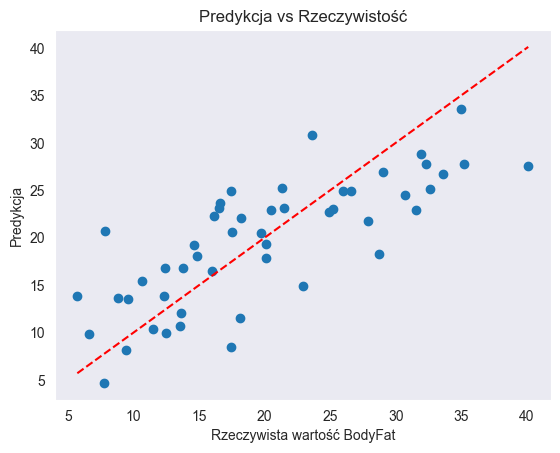
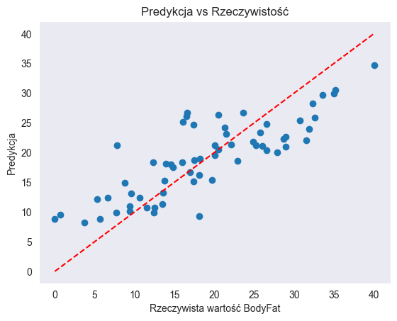

# 🧬 Predykcja Procentowej Zawartości Tłuszczu w Ciele

Projekt zrealizowany w ramach przedmiotu **Systemy Sztucznej Inteligencji**. Celem było stworzenie modelu regresyjnego (KNN), umożliwiającego oszacowanie poziomu tkanki tłuszczowej u człowieka na podstawie łatwo dostępnych danych antropometrycznych (wymiary ciała).

## 🎯 Cel Projektu
Stworzenie modelu predykcyjnego (Regresja KNN oraz Regresja Liniowa) dla datasetu "Body Fat Prediction", który pozwoli na dokładne określenie procentu tłuszczu w ciele bez konieczności stosowania skomplikowanych metod (np. ważenia podwodnego), a jedynie przy użyciu miarki krawieckiej i wagi.

## 📊 Dane Wejściowe
Zbiór danych zawiera pomiary dla 252 mężczyzn.
* **Cechy podstawowe:** Wiek, Waga, Wzrost.
* **Obwody:** Szyi, klatki piersiowej, brzucha, bioder, uda, kolana, kostki, bicepsa, przedramienia, nadgarstka.
* **Zmienna celu:** Procentowa zawartość tłuszczu (BodyFat).

## 🛠️ Technologie
* **Python** (Jupyter Notebook)
* **Pandas / NumPy** - manipulacja danymi
* **Matplotlib / Seaborn** - wizualizacja danych

## 🔬 Metodologia i Eksperymenty

Analiza przebiegała w kilku etapach, aby uzyskać jak najwyższy współczynnik $R^2$:

### 1. Testy na danych surowych
Pierwsze podejście bez przetwarzania danych.
* **Wynik:** $R^2 = 0.599$ (dla $k=5$)
* **Wniosek:** Duża rozbieżność predykcji, model wymaga optymalizacji.

### 3. Normalizacja danych
Zastosowano skalowanie danych, aby wszystkie cechy miały równy wpływ na obliczanie odległości w algorytmie KNN.
* **Wynik:** $R^2 = 0.624$ (dla $k=10$) – poprawa wyniku.

### 4. Redukcja zmiennych (Feature Selection)
Usunięto cechy o najmniejszej korelacji lub wprowadzające szum (Wzrost, Wiek, Obwód nadgarstka).
* **Wynik:** $R^2 = 0.673$ (dla $k=4$).

### 5. Inżynieria cech (Feature Engineering)
Dodano nowe zmienne oparte na stosunkach wymiarów, m.in.:
* `Abdomen / Hip`
* `Waist / Hip`
* `Thigh / Hip`
* `Weight / Height`
  
Usunięto obwód przedramienia.

## 🏆 Ostateczne Wyniki

Najlepszy model uzyskano po normalizacji, selekcji cech oraz dodaniu nowych wskaźników.

* **Algorytm:** KNN (k=3)
* **Współczynnik determinacji ($R^2$):** **0.723**
* **Średni błąd bezwzględny (MAE):** ~4.07 punktów procentowych

